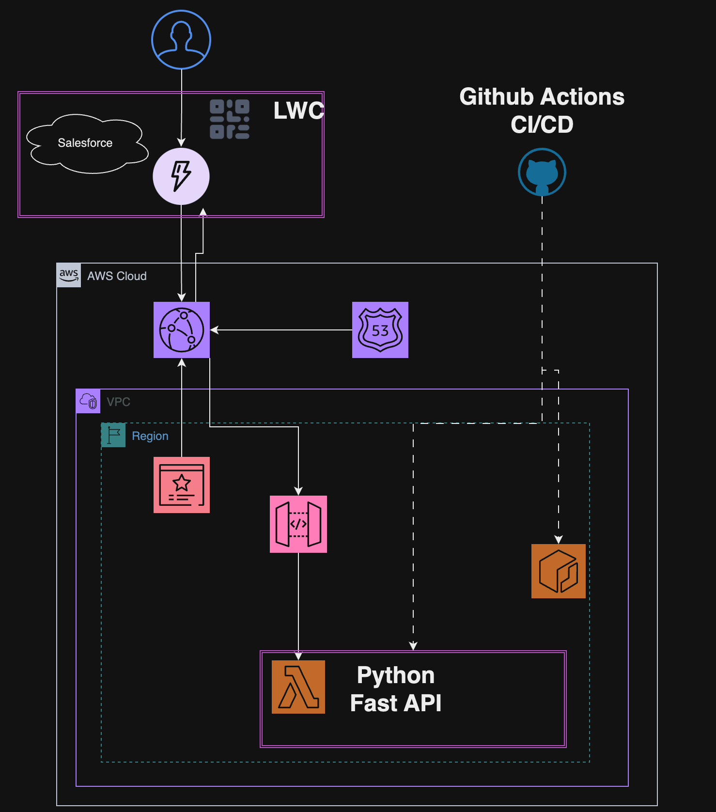

## 構成図



## Directory

```
├── Dockerfile
├── README.md
├── app
│   ├── __init__.py
│   └── main.py
├── compose.yml
├── requirements.lock
├── requirements.txt
├── terraform
│   ├── build
│   │   ├── function
│   │   │   └── main.py
│   │   └── layer
│   │       └── python
│   ├── envs
│   │   └── development
│   │       ├── backend.tf
│   │       ├── locals.tf
│   │       ├── main.tf
│   │       ├── provider.tf
│   │       ├── terraform.tfstate
│   │       └── terraform.tfstate.backup
│   ├── lambda
│   │   ├── function.zip
│   │   └── layer.zip
│   └── modules
│       ├── apigateway
│       │   ├── agw.tf
│       │   ├── iam.tf
│       │   └── variables.tf
│       └── lambda
│           ├── iam.tf
│           ├── lambda.tf
│           ├── outputs.tf
│           └── variables.tf
└── update-requreiment.sh
```

## How to Development

### local

- Clone Repository

- Docker

  ```sh
  docker compose build
  docker compose up
  ```

- How to Terraform

  - Regist AWS Credential

    ```sh
    # open aws credentials file
    vim ~/.aws/credentials
    ```

  - regist aws credential information

    ```sh
    [default]
    aws_access_key_id = xxxxxx
    aws_secret_access_key = xxxxxxx
    ```

  - Before Terraform Apply

    - Install Dependency Library
      ```sh
      pip install -r requirements.txt -t terraform/build/layer/python
      ```

- Install Libraly

  ```sh
  source update-requreiment.sh
  ```

- Delete pycache file
  ```sh
  find . | grep -E "(__pycache__|\.pyc|\.pyo$)" | xargs rm -rf
  ```
